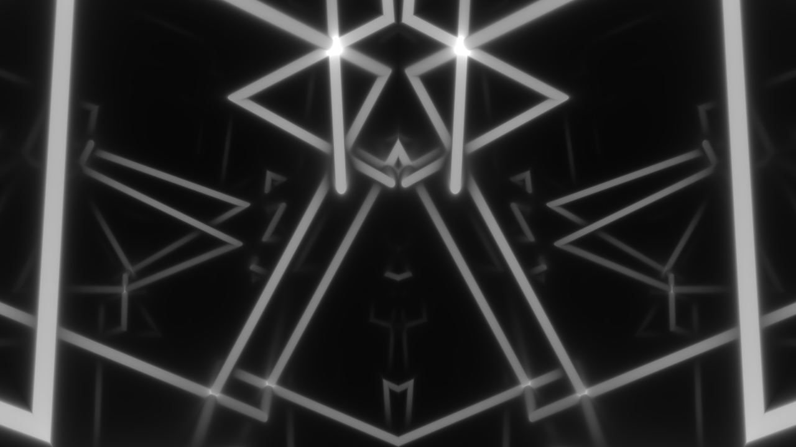

# 3D Grid

This effect creates a 3D Grid.

## Fractal

* `Itterations`: how much itterations
* `Resolution`: grid resolution
* `Thickness`: adjust Thickness of the grid lines
* `Seed`: seed value
* `Variance`: add a bit of variation to the grid

## Timing

* `Overall`: Speed: animation speed
* `Offset`: offsets the grid in time
* `Speed x`: horizontal speed adjustments
* `Speed y`: vertical speed adjustments
* `Speed z`: depth speed adjustments

## Position / Size

* `Center`: adjust the center of the grid
* `Zoom` : zoom in/out of the grid
