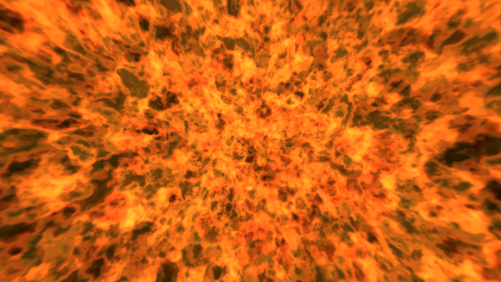

# Flame

Creates flame / fluid like patterns.

## Parameters

* `Time`
* `Pattern X`
* `Pattern Y`
* `Zoom`
* `Brightness`
* `Contrast`
* `Saturation`
* `Tint Intensity`
* `Volume Steps`
* `Step Size`
* `Density`
* `Frequency`
* `Amplitude`
